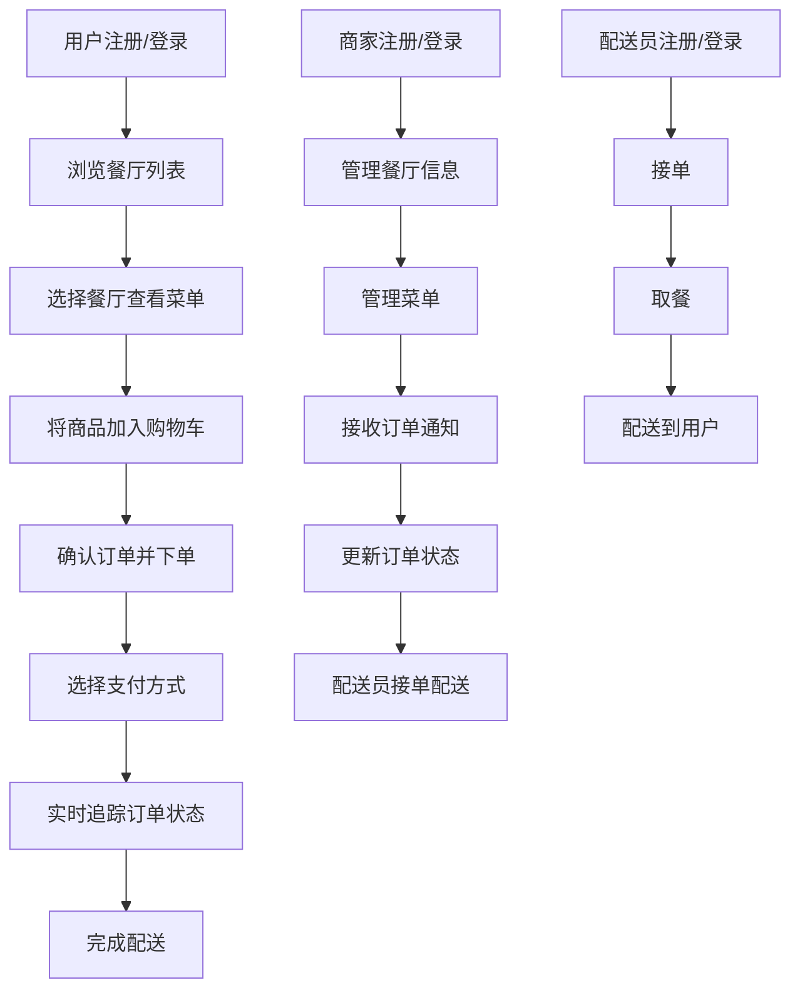

# MunchGo 在线订餐平台 - 项目规划文档

> 项目定位：Java + React 全栈练习项目
> 核心原则：简单实用、规范标准
> 预计周期：15 个工作日

---

## 一、项目背景

本项目（MunchGo）定位为 Java + React 全栈练习项目，目标是从零搭建一套完整可运行的在线订餐平台，覆盖用户端点餐和商家端管理两大核心场景。项目遵循"简单实用、规范标准"原则，聚焦前后端分离开发的基础流程和核心技术练习，避免复杂业务场景和过度架构设计，确保新手可跟随落地。

---

## 二、业务全链路梳理

### 2.1 核心业务流程



### 2.2 角色与权限

| 角色 | 功能范围 |
|------|----------|
| 顾客 (CUSTOMER) | 浏览餐厅、下单、支付、评价、查看订单、管理个人资料 |
| 商家 (RESTAURANT_OWNER) | 管理餐厅信息、管理菜单、处理订单、查看营收 |
| 配送员 (DRIVER) | 接收配送任务、更新配送状态 |
| 管理员 (ADMIN) | 管理所有商家、用户、订单，平台数据统计 |

### 2.3 核心业务实体

- **用户 (User)**: 平台所有角色的基础实体
- **餐厅 (Restaurant)**: 商家开设的店铺
- **菜品 (MenuItem)**: 餐厅提供的菜品
- **购物车 (Cart)**: 用户选购中的菜品
- **订单 (Order)**: 用户下的订单
- **订单项 (OrderItem)**: 订单中的具体菜品
- **地址 (Address)**: 用户的收货地址
- **评价 (Review)**: 用户对餐厅的评分和评价

---

## 三、技术架构

### 3.1 项目结构

```
MunchGo/
├── munchgo-backend/          # Spring Boot 4 REST API
├── munchgo-frontend/         # React 19 + Vite + TypeScript SPA
├── docker-compose.yml        # PostgreSQL 16 + Redis (future)
└── PROJECT_PLAN.md           # This file
```

### 3.2 技术选型

#### Backend
| 类别 | 技术 | 版本 |
|------|------|------|
| Framework | Spring Boot | 4.0.6 |
| Language | Java | 21 |
| Build Tool | Gradle | 9.4.1 |
| Database | PostgreSQL | 16 |
| ORM | Spring Data JPA | - |
| Validation | Jakarta Validation | - |
| Auth | JWT (jose4j) | - |
| API Docs | SpringDoc OpenAPI | 2.x |
| API Style | RESTful | - |

#### Frontend
| 类别 | 技术 | 版本 |
|------|------|------|
| Framework | React | 19.2.6 |
| Build Tool | Vite | 8.0.12 |
| Language | TypeScript | 6 |
| Styling | Plain CSS + CSS Variables | - |
| Routing | React Router | 7.x |
| State | Zustand | - |
| HTTP Client | Axios | - |
| Forms | React Hook Form + Zod | - |
| Icons | Lucide React | - |

### 3.3 系统架构图

```
┌─────────────────┐     ┌─────────────────┐     ┌─────────────────┐
│   Browser       │     │   Spring Boot   │     │   PostgreSQL    │
│   (React SPA)   │────▶│   REST API      │────▶│   Database      │
└─────────────────┘     └─────────────────┘     └─────────────────┘
       │                        │
       │                        ▼
       │               ┌─────────────────┐
       └──────────────▶│   Redis         │
          (future)     │   Cache/Session  │
                        └─────────────────┘
```

---

## 四、当前进度

### 4.1 已完成

- [x] Backend 项目脚手架 (Spring Boot 4 + Gradle + Java 21)
- [x] Frontend 项目脚手架 (React 19 + Vite + TypeScript)
- [x] PostgreSQL 16 安装并运行在 Docker 上

### 4.2 进行中

- [ ] 配置数据库连接 (Spring Boot + PostgreSQL)
- [ ] 设计并实现核心数据模型 / Entity
- [ ] 搭建后端分层架构 (Controller/Service/Repository)
- [ ] 配置 CORS 和 API Base URL
- [ ] 实现 JWT 认证

### 4.3 待开发

- [ ] 餐厅列表与搜索
- [ ] 菜单管理
- [ ] 购物车
- [ ] 下单与支付
- [ ] 订单追踪
- [ ] 用户中心
- [ ] 前端页面与组件
- [ ] Docker Compose 本地开发环境
- [ ] 前后端集成测试

---

## 五、后端开发

### 5.1 Package 结构

```
com.cwj.munchgobackend/
├── controller/          # REST Controllers
├── service/             # Business Logic
│   └── impl/            # Service Implementations
├── repository/          # Data Access (JPA)
├── entity/              # JPA Entities
├── dto/                 # Data Transfer Objects
│   ├── request/         # Incoming DTOs
│   └── response/        # Outgoing DTOs
├── config/              # Configuration Classes
├── security/            # JWT / Security Config
├── exception/           # Custom Exceptions & Handlers
└── MunchgoBackendApplication.java
```

### 5.2 数据库配置

在 `application.yaml` 中配置:

```yaml
spring:
  datasource:
    url: jdbc:postgresql://localhost:5432/munchgo
    username: munchgo
    password: ${DB_PASSWORD}
  jpa:
    hibernate:
      ddl-auto: update
    show-sql: true
    properties:
      hibernate:
        dialect: org.hibernate.dialect.PostgreSQLDialect
        format_sql: true
```

### 5.3 API 端点规划

#### 认证 Authentication
| 方法 | 端点 | 描述 |
|------|------|------|
| POST | /api/auth/register | 用户注册 |
| POST | /api/auth/login | 用户登录 |
| POST | /api/auth/refresh | 刷新 Token |

#### 餐厅 Restaurants
| 方法 | 端点 | 描述 |
|------|------|------|
| GET | /api/restaurants | 餐厅列表 (支持分页/搜索) |
| GET | /api/restaurants/{id} | 餐厅详情 |
| POST | /api/restaurants | 创建餐厅 (商家/管理员) |
| PUT | /api/restaurants/{id} | 更新餐厅 (商家/管理员) |
| DELETE | /api/restaurants/{id} | 删除餐厅 (管理员) |

#### 菜单 Menu
| 方法 | 端点 | 描述 |
|------|------|------|
| GET | /api/restaurants/{id}/menu | 获取餐厅菜单 |
| POST | /api/restaurants/{id}/menu | 添加菜品 (商家/管理员) |
| PUT | /api/menu/{id} | 更新菜品 (商家/管理员) |
| DELETE | /api/menu/{id} | 删除菜品 (商家/管理员) |

#### 购物车 Cart
| 方法 | 端点 | 描述 |
|------|------|------|
| GET | /api/cart | 获取购物车 |
| POST | /api/cart/items | 添加购物车项 |
| PUT | /api/cart/items/{id} | 更新购物车项数量 |
| DELETE | /api/cart/items/{id} | 删除购物车项 |
| DELETE | /api/cart | 清空购物车 |

#### 订单 Orders
| 方法 | 端点 | 描述 |
|------|------|------|
| POST | /api/orders | 创建订单 (结账) |
| GET | /api/orders/{id} | 订单详情 |
| GET | /api/orders/user/{userId} | 用户订单历史 |
| PUT | /api/orders/{id}/status | 更新订单状态 |
| DELETE | /api/orders/{id} | 取消订单 |

#### 用户 Users
| 方法 | 端点 | 描述 |
|------|------|------|
| GET | /api/users/{id} | 获取用户资料 |
| PUT | /api/users/{id} | 更新用户资料 |
| GET | /api/users/{id}/addresses | 获取收货地址 |
| POST | /api/users/{id}/addresses | 添加收货地址 |
| PUT | /api/users/{id}/addresses/{addrId} | 更新收货地址 |
| DELETE | /api/users/{id}/addresses/{addrId} | 删除收货地址 |

#### 评价 Reviews
| 方法 | 端点 | 描述 |
|------|------|------|
| POST | /api/orders/{orderId}/review | 订单完成后评价 |
| GET | /api/restaurants/{id}/reviews | 餐厅评价列表 |

---

## 六、前端开发

### 6.1 目录结构

```
src/
├── api/                 # Axios API 客户端
│   └── instance.ts      # Axios 实例配置
├── assets/              # 静态资源
├── components/          # 可复用 UI 组件
│   ├── common/          # Button, Input, Card, Modal 等
│   ├── layout/          # Header, Footer, Sidebar
│   └── features/        # 功能组件 (RestaurantCard, MenuItem, etc.)
├── hooks/               # Custom React Hooks
├── pages/               # 页面组件
├── store/               # Zustand 状态管理
├── types/               # TypeScript 类型定义
├── utils/               # 工具函数
├── App.tsx
└── main.tsx
```

### 6.2 页面路由

| 路由 | 页面 | 描述 |
|------|------|------|
| `/` | HomePage | 首页餐厅列表 |
| `/restaurant/:id` | RestaurantPage | 餐厅详情与菜单 |
| `/cart` | CartPage | 购物车 |
| `/checkout` | CheckoutPage | 结账页面 |
| `/orders` | OrdersPage | 订单历史 |
| `/order/:id` | OrderDetailPage | 订单详情/追踪 |
| `/profile` | ProfilePage | 用户资料 |
| `/login` | LoginPage | 登录 |
| `/register` | RegisterPage | 注册 |
| `/admin/restaurants` | AdminRestaurantsPage | 商家管理 |
| `/admin/orders` | AdminOrdersPage | 订单管理 |

---

## 七、数据库设计

### 7.1 ER 图概览

```
Users ───1:N─── Addresses
  │                      │
  │ 1:N                  │
  ▼                      │
Restaurants ──1:N── MenuItems
  │                      │
  │ 1:N                  │
  ▼                      │
Orders ────N:1──────────┘
  │
  │ 1:N
  ▼
OrderItems
  │
  │ N:1
  ▼
Reviews
```

### 7.2 表结构

#### users
| 字段 | 类型 | 约束 | 描述 |
|------|------|------|------|
| id | UUID | PK | 主键 |
| email | VARCHAR(255) | UNIQUE, NOT NULL | 邮箱 |
| password_hash | VARCHAR(255) | NOT NULL | BCrypt 加密密码 |
| full_name | VARCHAR(100) | NOT NULL | 姓名 |
| phone | VARCHAR(20) | | 电话 |
| role | VARCHAR(20) | NOT NULL | CUSTOMER / RESTAURANT_OWNER / DRIVER / ADMIN |
| created_at | TIMESTAMP | NOT NULL | 创建时间 |
| updated_at | TIMESTAMP | NOT NULL | 更新时间 |

#### restaurants
| 字段 | 类型 | 约束 | 描述 |
|------|------|------|------|
| id | UUID | PK | 主键 |
| name | VARCHAR(100) | NOT NULL | 餐厅名称 |
| description | TEXT | | 描述 |
| address | VARCHAR(255) | NOT NULL | 地址 |
| phone | VARCHAR(20) | | 电话 |
| image_url | VARCHAR(500) | | 图片 |
| rating | DECIMAL(2,1) | DEFAULT 0 | 评分 |
| is_active | BOOLEAN | DEFAULT TRUE | 营业状态 |
| owner_id | UUID | FK(users.id) | 店主 |
| created_at | TIMESTAMP | NOT NULL | 创建时间 |
| updated_at | TIMESTAMP | NOT NULL | 更新时间 |

#### menu_items
| 字段 | 类型 | 约束 | 描述 |
|------|------|------|------|
| id | UUID | PK | 主键 |
| restaurant_id | UUID | FK(restaurants.id) | 所属餐厅 |
| name | VARCHAR(100) | NOT NULL | 菜品名 |
| description | TEXT | | 描述 |
| price | DECIMAL(10,2) | NOT NULL | 价格 |
| image_url | VARCHAR(500) | | 图片 |
| category | VARCHAR(50) | | 分类 |
| is_available | BOOLEAN | DEFAULT TRUE | 可售状态 |
| created_at | TIMESTAMP | NOT NULL | 创建时间 |
| updated_at | TIMESTAMP | NOT NULL | 更新时间 |

#### orders
| 字段 | 类型 | 约束 | 描述 |
|------|------|------|------|
| id | UUID | PK | 主键 |
| user_id | UUID | FK(users.id) | 下单用户 |
| restaurant_id | UUID | FK(restaurants.id) | 餐厅 |
| driver_id | UUID | FK(users.id), NULL | 配送员 |
| status | VARCHAR(20) | NOT NULL | 订单状态 |
| total_amount | DECIMAL(10,2) | NOT NULL | 总金额 |
| delivery_address | VARCHAR(255) | NOT NULL | 收货地址 |
| notes | TEXT | | 备注 |
| created_at | TIMESTAMP | NOT NULL | 创建时间 |
| updated_at | TIMESTAMP | NOT NULL | 更新时间 |

#### order_items
| 字段 | 类型 | 约束 | 描述 |
|------|------|------|------|
| id | UUID | PK | 主键 |
| order_id | UUID | FK(orders.id) | 所属订单 |
| menu_item_id | UUID | FK(menu_items.id) | 菜品 |
| quantity | INTEGER | NOT NULL | 数量 |
| unit_price | DECIMAL(10,2) | NOT NULL | 下单时单价 |
| subtotal | DECIMAL(10,2) | NOT NULL | 小计 |

#### addresses
| 字段 | 类型 | 约束 | 描述 |
|------|------|------|------|
| id | UUID | PK | 主键 |
| user_id | UUID | FK(users.id) | 所属用户 |
| label | VARCHAR(50) | | 标签(家/公司) |
| street | VARCHAR(255) | NOT NULL | 街道地址 |
| city | VARCHAR(100) | NOT NULL | 城市 |
| state | VARCHAR(100) | NOT NULL | 省份 |
| zip_code | VARCHAR(20) | | 邮编 |
| is_default | BOOLEAN | DEFAULT FALSE | 默认地址 |

#### reviews
| 字段 | 类型 | 约束 | 描述 |
|------|------|------|------|
| id | UUID | PK | 主键 |
| order_id | UUID | FK(orders.id) | 关联订单 |
| user_id | UUID | FK(users.id) | 评价用户 |
| restaurant_id | UUID | FK(restaurants.id) | 餐厅 |
| rating | INTEGER | NOT NULL | 评分 1-5 |
| comment | TEXT | | 评价内容 |
| created_at | TIMESTAMP | NOT NULL | 创建时间 |

---

## 八、Docker 环境

### 8.1 PostgreSQL 16

- 已安装并运行在 Docker 中
- 容器名称: `munchgo-postgres` (待确认)
- 端口: `5432`
- 超级用户密码: `7689` (sudo 密码)
- 数据库: `munchgo` (待创建)
- 用户: `munchgo` (待创建)

### 8.2 docker-compose.yml (待创建)

```yaml
version: '3.8'
services:
  postgres:
    image: postgres:16
    container_name: munchgo-postgres
    environment:
      POSTGRES_DB: munchgo
      POSTGRES_USER: munchgo
      POSTGRES_PASSWORD: ${DB_PASSWORD}
    ports:
      - "5432:5432"
    volumes:
      - postgres_data:/var/lib/postgresql/data
  redis:
    image: redis:7-alpine
    container_name: munchgo-redis
    ports:
      - "6379:6379"
volumes:
  postgres_data:
```

---

## 九、环境变量

### Backend (.env)
```
DB_PASSWORD=your_secure_password_here
JWT_SECRET=your_jwt_secret_here_minimum_256_bits
JWT_EXPIRATION=86400000
```

### Frontend (.env)
```
VITE_API_BASE_URL=http://localhost:8080/api
```

---

## 十、开发工作流

### Phase 1: 基础设施 (当前)
- [ ] 配置 PostgreSQL 数据库连接
- [ ] 初始化数据库和用户
- [ ] 完善后端依赖 (JPA, Security, Validation 等)
- [ ] 完善前端依赖 (React Router, Zustand, Axios 等)

### Phase 2: 后端核心
- [ ] 创建 Entity 类
- [ ] 创建 Repository 接口
- [ ] 实现 Service 层
- [ ] 实现 REST Controller
- [ ] 添加参数校验和异常处理
- [ ] 实现 JWT 认证

### Phase 3: 前端核心
- [ ] 配置路由
- [ ] 搭建布局组件 (Header, Footer)
- [ ] 搭建通用组件 (Button, Card, Input)
- [ ] 实现登录/注册页面
- [ ] 实现首页餐厅列表

### Phase 4: 业务功能
- [ ] 餐厅详情与菜单页
- [ ] 购物车功能
- [ ] 下单与订单管理
- [ ] 用户中心
- [ ] 商家管理后台

### Phase 5: 测试与部署
- [ ] 后端单元测试
- [ ] 前端组件测试 (Vitest + Testing Library)
- [ ] E2E 测试 (Playwright)
- [ ] Docker 容器化
- [ ] CI/CD 流水线 (GitHub Actions)

---

## 十一、部署规划

| 组件 | 部署方式 |
|------|----------|
| Backend | Docker 容器，部署到云服务器 (AWS EC2 / 阿里云 ECS) |
| Frontend | 静态站点，部署到 Vercel / Netlify / 阿里云 OSS |
| Database | PostgreSQL 16 (本地 Docker 或云数据库 RDS) |
| Cache | Redis (本地 Docker 或云数据库 Redis) |
| CI/CD | GitHub Actions |
